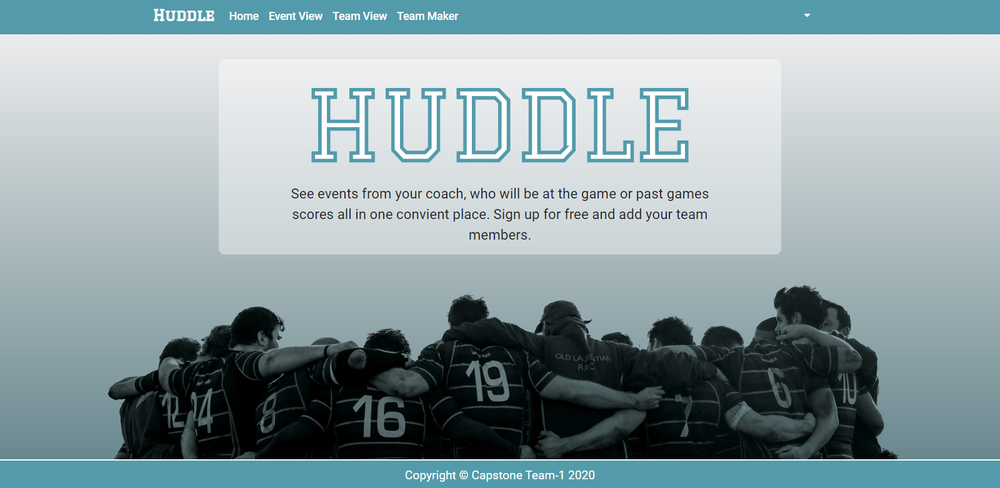

# SERN Huddle

**Project 3 for University of Toronto coding Bootcamp.**

Huddle is a team manager application where Users can formulate teams based on the sport, they can also arrange meet ups and venues.

**Project Details**

This project focused on using everything we have learnt in the course thus far as a team using.

1. Git version-control system for tracking changes.
2. Travis and heroku for project continous integration and hosting.
3. Auth0 for authentication.
4. SERN stack for development (mySQL, Express, React, Node)

**Application Features**

- Creates user profiles
- Users user can create, view and update teams
- Users can add and view events for their teams

**Team:** Andy Durette, Bernie Ip, Brad Karulus, Gavin Wimalachandran, Kirill Volodkin
Maryam Kazemi, Peng Lei
**Live Demo:** https://lets-huddle.herokuapp.com/

This project was bootstrapped with [Create React App](https://github.com/facebook/create-react-app).

## Available Scripts

In the project directory, you can run:

### `npm start`

Runs the app in the development mode. 
Open [http://localhost:3000](http://localhost:3000) to view it in the browser.

The page will reload if you make edits. 
You will also see any lint errors in the console.

### `npm test`

Launches the test runner in the interactive watch mode. 
See the section about [running tests](https://facebook.github.io/create-react-app/docs/running-tests) for more information.

### `npm run build`

Builds the app for production to the `build` folder. 
It correctly bundles React in production mode and optimizes the build for the best performance.

The build is minified and the filenames include the hashes. 
Your app is ready to be deployed!

See the section about [deployment](https://facebook.github.io/create-react-app/docs/deployment) for more information.

